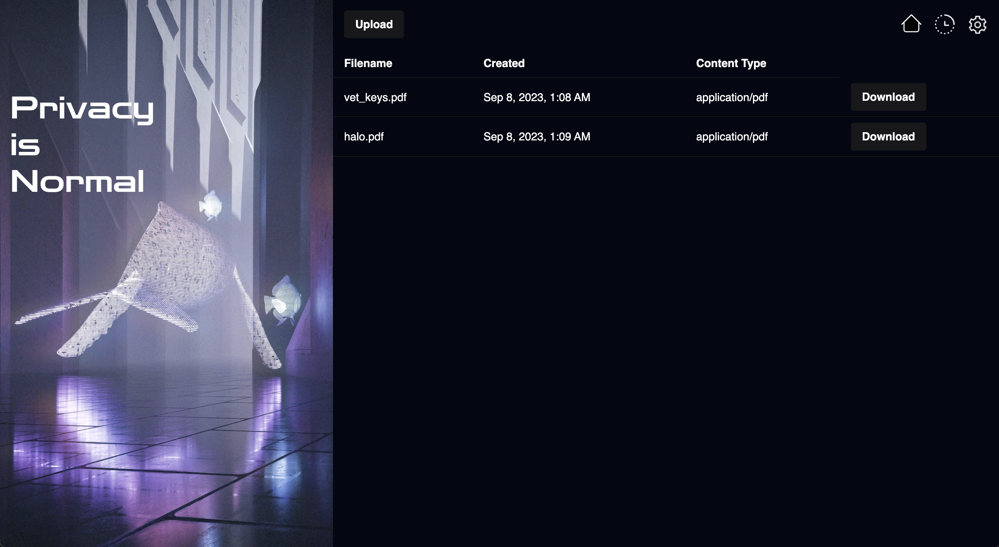

# capsule

**Description:**

A capsule/storage to share files with others.

A time capsule for files and cherished memories to unlock at a future date.

A fail-safe switch for moments of fear.

A time-based encryption for revealing things to the world at random.



## Dev

```
npm i
dfx start --clean

dfx deploy vetkd_system_api
dfx deploy file_storage --argument='(false)'
dfx deploy capsule
dfx deploy ui
```

Note: change `VETKD_SYSTEM_API` for local vs prod

## Testing

```
npm run test
```

## Env

```
MOTOKO_IDENTITY=
ZOOKO_IDENTITY=
SATOSHI_IDENTITY=
```
